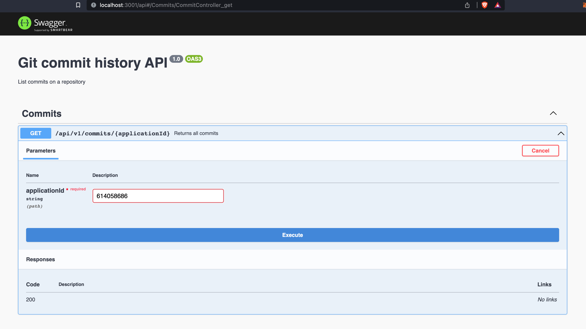
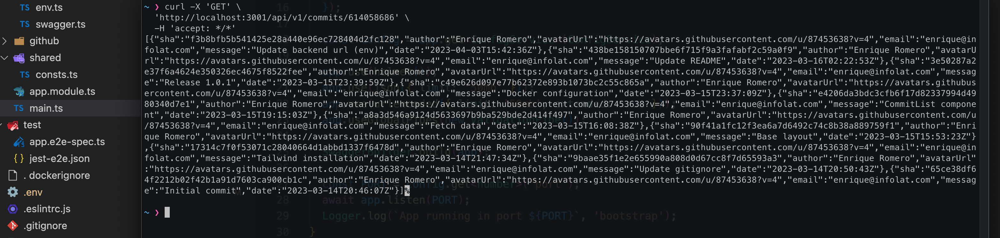

# Commit history BFF

Backend API that returns all commits for the following repository:
- https://github.com/eromerodev/commit-history-app

## Getting Started

First, run the development api server:

```bash
# download or clone the project
git clone git@github.com:eromerodev/commit-history-bff.git

# go to the project root
cd commit-history-bff

# install dependencies
npm i

# start development server
npm run start:dev
```

Open [http://localhost:3001](http://localhost:3001) with your browser to see the result.



## Calling the API

```sh
#curl request example

curl -X 'GET' \
  'http://localhost:3001/api/v1/commits/614058686' \
  -H 'accept: */*'

```



## Frontend setup

You can use the url of this project to set `COMMITS_API_URL` env variable in the frontend application.

```js
//env variable in the frontend
COMMITS_API_URL="http://localhost:3001/api/v1/commits/614058686"
```


